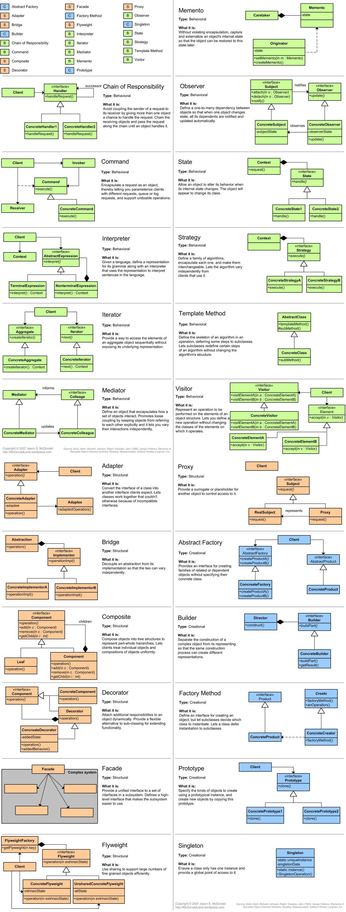

# Gang of Four Design Patterns

- [Gang of Four Design Patterns](#gang-of-four-design-patterns)
  - [Links](#links)
  - [Spring Design Patterns](#spring-design-patterns)
  - [JEE Design Patterns](#jee-design-patterns)
  - [Microservice Patterns](#microservice-patterns)
  - [List of Design Patterns](#list-of-design-patterns)
    - [Creational pattern](#creational-pattern)
    - [Structural](#structural)
    - [Behavioral](#behavioral)
  - [Overview of Common Design Patterns](#overview-of-common-design-patterns)
  - [API Design Patterns O'Reilly Book](#api-design-patterns-oreilly-book)
    - [Chapter 4 - Resource Scope and Hierarchy](#chapter-4---resource-scope-and-hierarchy)

## Links

- <https://en.wikipedia.org/wiki/Design_Patterns>

## Spring Design Patterns

- <http://www.javabench.in/2012/02/design-patterns-being-used-in-spring.html>
- <http://stackoverflow.com/questions/755563/what-are-the-design-patterns-which-used-in-spring-framework\#!>

## JEE Design Patterns

TODO

## Microservice Patterns

- API Gateway pattern for microservices <https://medium.com/design-microservices-architecture-with-patterns/api-gateway-pattern-8ed0ddfce9df>
- Site with lots of nice patterns to use - <https://microservices.io/index.html>
  - Created by Chris Richardson who wrote "Microservice Patterns" book

## List of Design Patterns

Patterns by Type Creational Main article:
<http://en.wikipedia.org/wiki/Design_Patterns>

### Creational pattern

Creational patterns are ones that create objects for you, rather than
having you instantiate objects directly. This gives your program more
flexibility in deciding which objects need to be created for a given
case.

- Abstract Factory groups object factories that have a common theme.
- [Builder](https://en.wikipedia.org/wiki/Builder_pattern) constructs
    complex objects by separating construction and representation.
- Factory Method creates objects without specifying the exact class to
    create.
- Prototype creates objects by cloning an existing object.
- Singleton restricts object creation for a class to only one
    instance.

### Structural

These concern class and object composition. They use inheritance to
compose interfaces and define ways to compose objects to obtain new
functionality.

- Adapter allows classes with incompatible interfaces to work together
    by wrapping its own interface around that of an already existing
    class.
- Bridge decouples an abstraction from its implementation so that the
    two can vary independently.
- Composite composes zero-or-more similar objects so that they can be
    manipulated as one object.
- Decorator dynamically adds/overrides behaviour in an existing method
    of an object.
- Facade provides a simplified interface to a large body of code.
- Flyweight reduces the cost of creating and manipulating a large
    number of similar objects.
- Proxy provides a placeholder for another object to control access,
    reduce cost, and reduce complexity.

### Behavioral

Most of these design patterns are specifically concerned with
communication between objects.

- Chain of responsibility delegates commands to a chain of processing
    objects.
- Command creates objects which encapsulate actions and parameters.
- Interpreter implements a specialized language.
- Iterator accesses the elements of an object sequentially without
    exposing its underlying representation.
- Mediator allows loose coupling between classes by being the only
    class that has detailed knowledge of their methods.
- Memento provides the ability to restore an object to its previous
    state (undo).
- Observer is a publish/subscribe pattern which allows a number of
    observer objects to see an event.
- State allows an object to alter its behavior when its internal state
    changes.
- Strategy allows one of a family of algorithms to be selected
    on-the-fly at runtime.
- Template method defines the skeleton of an algorithm as an abstract
    class, allowing its subclasses to provide concrete behavior.
- Visitor separates an algorithm from an object structure by moving
    the hierarchy of methods into one object.

## Overview of Common Design Patterns

## API Design Patterns O'Reilly Book

- <https://learning.oreilly.com/library/view/api-design-patterns/9781617295850/OEBPS/Text/04.htm#heading_id_14>

### Chapter 4 - Resource Scope and Hierarchy

- See highlights for direct link to AntiPatterns of Resource organization
- Antipatterns list
  - Everything is a resource
  - Deep hierarchies
  - Inline everything

- TODO - exercises 4.4