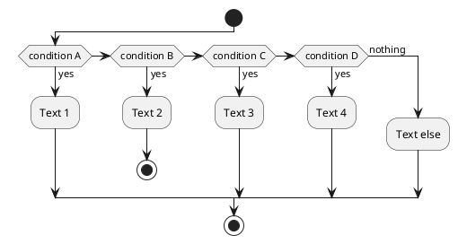

# Swagger2puml and OpenApi2puml

- [Swagger2puml and OpenApi2puml](#swagger2puml-and-openapi2puml)
  - [My fork of Swagger2PlantUML](#my-fork-of-swagger2plantuml)
  - [Links for adding SpringBoot:](#links-for-adding-springboot)
  - [Continuous Integration, publishing etc.](#continuous-integration-publishing-etc)
  - [OpenAPI2PUML technical notes](#openapi2puml-technical-notes)
    - [Control flow](#control-flow)
    - [My Notes](#my-notes)
    - [Links to PlantUML resources](#links-to-plantuml-resources)

## My fork of Swagger2PlantUML

- <https://github.com/DarrenC/swagger2puml>

## Links for adding SpringBoot:

- <https://www.baeldung.com/spring-boot-migration>
- <https://3ldn.nl/2016/02/16/spring-boot-in-an-existing-application-part-1/>
- <https://github.com/kuipercm/springboot-hello-world-app/blob/master/pom.xml>
- <https://stackoverflow.com/questions/14467325/maven-combining-multiple-module-jars-into-one-war-file>

## Continuous Integration, publishing etc.

- Travis CI -
    <https://blog.frankel.ch/travis-ci-tutorial-for-java-projects/>

## OpenAPI2PUML technical notes

These are my notes about how the project is structured and the flow
through the logic

### Control flow

- Entry point is OpenApi2PlantUML class where the main() is
  - It will handle the inputs, does some checking and then calls
        PlantUMLGenerator
- PlantUMLGenerator.transformOpenApi2Puml then handles parsing Swagger
    spec, calling PlantUMLCodegen and generating the diagram image
  - Parsing Swagger spec is done by calling the Swagger parser and
        then handling the java objects returned
  - PlanUMLCodegen is detailed below but creates a plantUML file at
        the location specified input
  - Generating an image file is done if required (currently buggy)
- PlantUMLCodegen handles
  - converting the parsed Swagger objects into the application
        object model
    - Swagger Model definitions become PlantUML Classes
    - Swagger Paths become PlantUML Interfaces
    - The compositions between the models and paths become the
            PlantUML Relations
  - building a key-value map of the objects to be used in the
        mustache template
  - calling the mustache template to generate the plantuml code

### Class building

We get the list of Models and loop through each one
- Super class: this is getting I guess the extended parent class but has different processing depending on if model is arrray model or impl TODO - understand this better
- Class Members: getting the properties of the class but varies depending on ref properties or simple properties and a lot of refactoring is neeeded here 
  - TODO: many repeated overloads without clear indication of what the override does
- Child classes: getting child class relations here but not very clear about what this is and why it is needed... TODO - expand understanding of this one and especially why we don't have source class added here and instead do it in the relation building.

### Interface building

- Converts paths to Interfaces
  - TODO - the way that the tags are used to determine Interface name means that we cannot decode the stripe spec for example since it doesn't use tags or ids.

### Relation building

### My Notes

- There are a lot of misplaced responsibilities in the current setup
  - The mustache utility also writes the plantuml file
    - this responsibility is not well placed and stops us using the generator for anything apart from generating files, we could never use it say a web app or as a service to stream back the generated puml code in text for example.


```plantuml
Alice -> Bob: Authentication Request
Bob --> Alice: Authentication Response
Alice -> Bob: Another authentication Request
Alice <-- Bob: another authentication Response
```

---



### Links to PlantUML resources

- Activity Diagram aka flowchart (new beta) -
    <https://plantuml.com/activity-diagram-beta>
- Git hub PlantUML space - <https://github.com/plantuml/plantuml>
- A very nice cookbook with lots of new use cases -
    <https://crashedmind.github.io/PlantUMLHitchhikersGuide/>
- PDF guide of original docs - <http://plantuml.com/guide>
- Online PUML editor - <https://www.planttext.com/>
